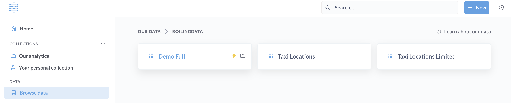
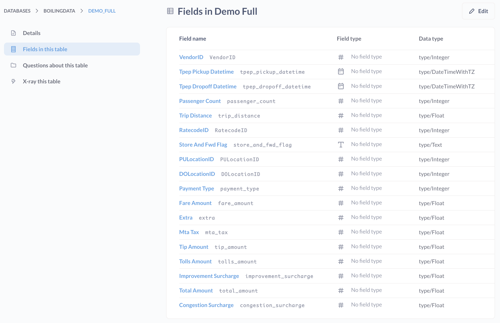

# BoilingData HTTP Gateway

- [Register](#register)
- [BI Tools via Presto connector](#bi-tools-via-presto-connector)
  - [1. Select Presto connector](#1-select-presto-connector)
  - [2. Configure connection to Boiling Buenavista](#2-configure-connection-to-boiling-buenavista)
  - [3. Run seamless local and remote SQL queries](#3-run-seamless-local-and-remote-sql-queries)
- [Standalone HTTP Gateway](#standalone-http-gateway)

## Register

1. Register to [Boiling either online](https://app.boilingdata.com/) or by using the [BDCLI](https://github.com/boilingdata/boilingdata-bdcli).
2. Compile and build Boiling HTTP Gateway container image:

```shell
yarn install
yarn build
# Your BoilingData credentials are passed through the environment variables
BD_USERNAME=myBdAccount@cc.com BD_PASSWORD=myBdSecretPw docker-compose up -d boilingdata_http_gw
# Ready to query Boiling!
curl -s -H 'Content-Type: application/json' localhost:3100 \
    -d "{\"statement\":\"SELECT * FROM parquet_scan('s3://boilingdata-demo/test.parquet');\"}"
```

The `curl` command returns 10 entries similar to this.

```json
[
  {
    "registration_dttm": "2016-02-03 07:55:29+00",
    "id": 1,
    "first_name": "Amanda",
    "last_name": "Jordan",
    "email": "ajordan0@com.com",
    "gender": "Female",
    "ip_address": "1.197.201.2",
    "cc": "6759521864920116",
    "country": "Indonesia",
    "birthdate": "3/8/1971",
    "salary": 49756.53,
    "title": "Internal Auditor",
    "comments": "1E+02"
  }
]
```

> NOTE: see also [standalone with python](doc/standalone.md) guide.

## BI Tools via Presto connector

If you want to run BI Tool with Presto connector:

- Checkout [Buenavista Boiling Proxy](https://github.com/dforsber/buenavista) and build it (creates `buenavista` docker image)
- Start e.g. Metabase, Boiling Buenavista, and Boiling HTTP GW locally and start querying

```shell
BD_USERNAME=myBdAccount@cc.com BD_PASSWORD=myBdSecretPw docker-compose up -d
```

> You can run queries both locally and remote on Boiling from the same BI Tool interface as Buenavista Proxy accompanies DuckDB database. Your BI Tool does not need to know the difference, it's all SQL.

> The Boiling Buenavista Proxy handles all the SQL queries, has embedded DuckDB as default target. By matching the SQL with keywoards we relay some queries to Boiling, get the results back to local DuckDB and update the query to consume the results now in the local DuckDB.

See the [docker-compose.yml](docker-compose.yml) file for running some BI Tools.

Example with Metabase:

### 1. Select Presto connector


### 2. Configure connection to Boiling Buenavista

**NOTE! Use "boilingdata" catalog instead of "main"**


### 3. Run seamless local and remote SQL queries


### 4. Discover Boiling Data Catalog - Data Sets shared to you




## Standalone HTTP Gateway

See [standalone with python](doc/standalone.md).
