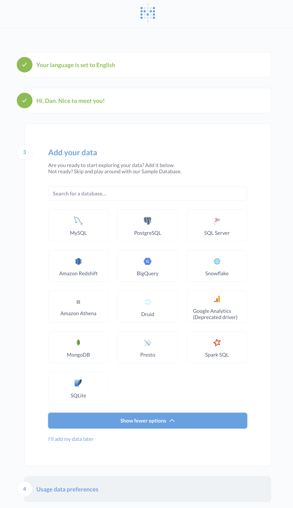
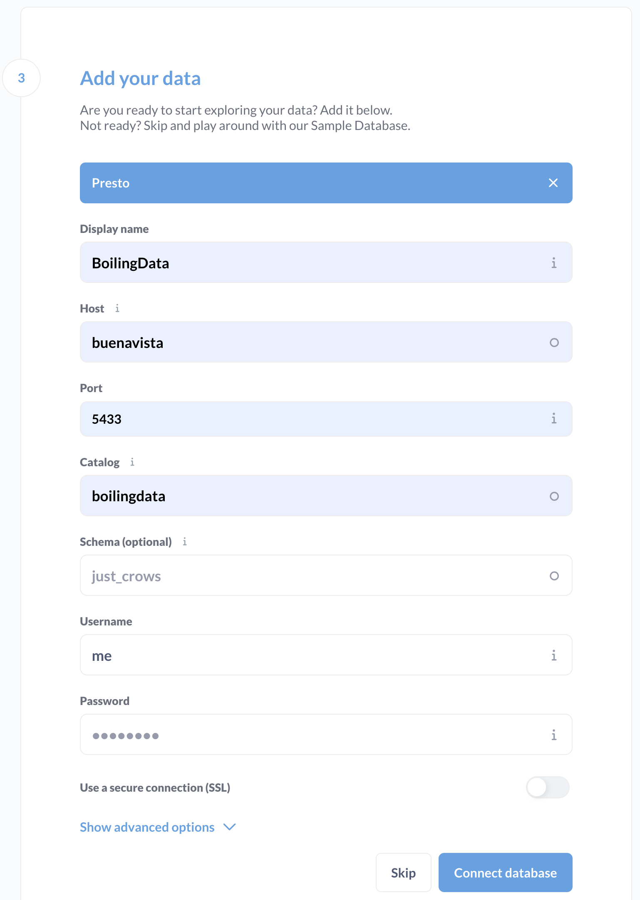
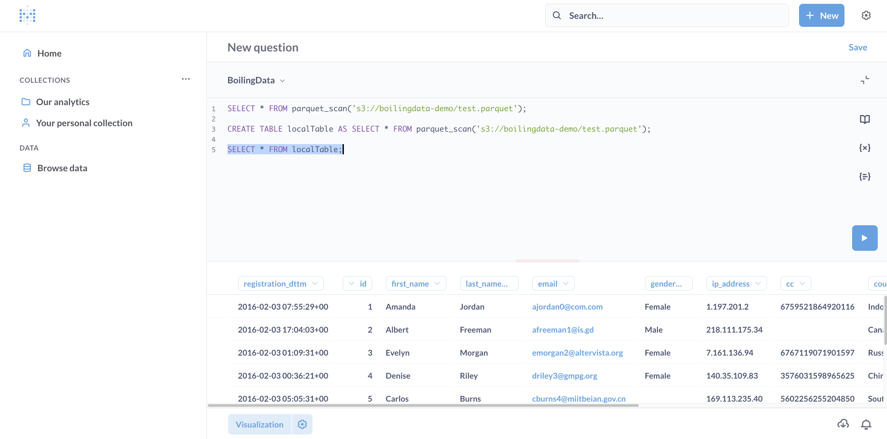

# BoilingData HTTP Gateway

1. Compile and build Boiling HTTP Gateway: `yarn build`
2. Checkout [Buenavista Boiling Proxy](https://github.com/dforsber/buenavista) and build it (creates `buenavista` docker image)
3. Start e.g. Metabase, Boiling Buenavista, and Boiling HTTP GW locally and start querying

```shell
BD_USERNAME=myBdAccount@cc.com BD_PASSWORD=myBdSecretPw docker-compose up
```

> You can run queries both locally and remote on Boiling from the same BI Tool interface as Buenavista Proxy accompanies DuckDB database. Your BI Tool does not need to know the difference, it's all SQL.

> The Boiling Buenavista Proxy handles all the SQL queries, has embedded DuckDB as default target. By matching the SQL with keywoards we relay some queries to Boiling, get the results back to local DuckDB and update the query to consume the results now in the local DuckDB.

# BI Tools via Presto connector

See the [docker-compose.yml](docker-compose.yml) file for running some BI Tools.

Example with Metabase:

### 1. Select Presto connector



### 2. Configure connection to Boiling Buenavista



### 3. Run seamless local and remote SQL queries



## Standalone

See [standalone with python](doc/standalone.md).
